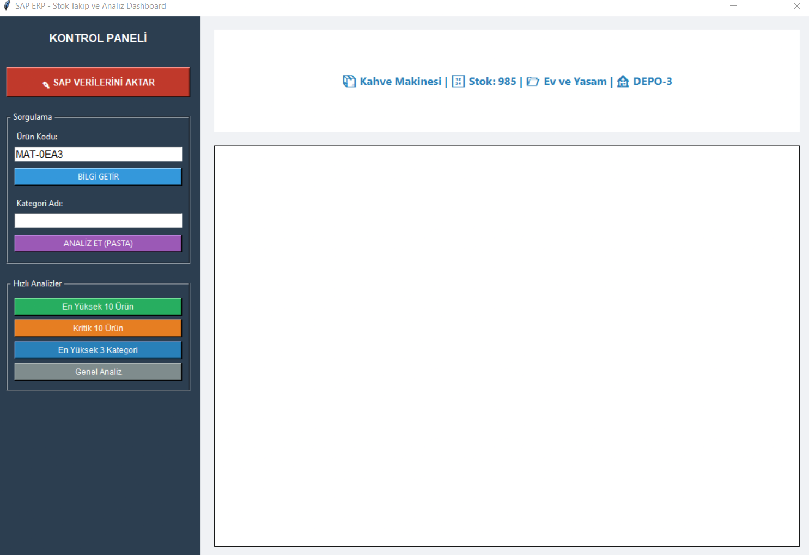

# SAP ERP & Python Hybrid Inventory Analytics Dashboard

This project demonstrates a complete **Enterprise Data Pipeline** that bridges the gap between a legacy ERP environment (**SAP**) and modern data science tools (**Python**). 

## 🛰 Project Architecture
The system is designed to handle enterprise-level data through a two-layer architecture:

1.  **Backend (SAP ABAP):** * Developed a custom ABAP Report (`stock_uploader.abap`) to automate data ingestion.
    * Features: High-speed data splitting (CSV parsing), condensation logic, and bulk database updates to custom SAP tables (`ZSTOK_TABLO_NEW`).
    * Optimizations: Used `Internal Tables` and `sy-subrc` error handling for reliable data processing.

2.  **Frontend & Analytics (Python):** * A professional desktop dashboard (`stock_dashboard.py`) built with `Tkinter`.
    * Features: Real-time data fetching, categorical stock analysis using `Pandas` grouping, and dynamic KPI visualization with `Matplotlib`.
    * UI/UX: Custom sidebar-based navigation for intuitive data exploration.

## 🚀 Key Engineering Highlights
* **ETL Pipeline:** Built a custom ETL (Extract, Transform, Load) process under technical network constraints.
* **Rapid Prototyping:** Transformed raw SAP data into actionable insights in a highly efficient development cycle.
* **Decision Support:** Automated the identification of "Critical Stock Levels" and "Top Performing Categories."

## 🛠 Tech Stack
* **ERP Environment:** SAP ABAP (SE11, SE38, OpenSQL)
* **Programming:** Python 3.x
* **Libraries:** Pandas, Matplotlib, Tkinter, OS
* **Data Format:** CSV (Semicolon Delimited)

## 📸 Dashboard Preview

*(Note: Replace this with your actual dashboard screenshot to showcase the working product!)*

---
Developed as part of a Software Engineering Internship at NOC BT Yazılım Danışmanlık.
